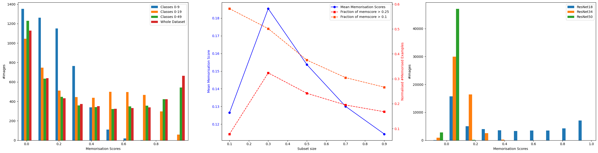

# What is the role of memorization in Continual Learning?

This repository is the official implementation of [What is the role of memorization in Continual Learning?](https://arxiv.org/). 

---
**Abstract**

Memorization is known to impact the performance of deep learning algorithms. Prior works have studied memorization primarily in the context of generalization and privacy. In this work, we focus on studying the effects of memorization on continual training in non-stationary environments. While forgetting prevention and memorization seem to be similar, but they are distinct. We discuss the difference between them and design extensive experiments to evaluate the influence of memorization on Continual Learning. 
We find that learning examples with high memorization scores are forgotten faster than regular samples. Our results indicate that memorization is necessary to achieve the highest performance, however, at low memory regimes, forgetting of regular samples is more important. We show that the importance of a high-memorization score sample rises with an increase of the buffer size. 
To showcase how memorization can be used during incremental training, we introduce a memorization proxy and use it in the buffer policy problem. We demonstrate that including samples with a higher proxy memorization score is beneficial when the buffer size is large.
---




## Requirements

To install requirements:

```setup
conda env create -f env.yml -y
conda activate memorisation-cl
```
Before runing any experiments please run following commands to create and activate the environement.
Datasets are automatically downloaded into '/usr/share/mammoth_datasets/' folder. It may be the case, that python script will not have permission to create and modify files in that directory. In that case manual change of linux permissions is required for specific folders. 

Most of the experiments were done with CUDA Version: 12.2.

## Training

To train the model(s) in the paper, run this command:

```train
python main.py --model="maer" --buffer_policy="min" --dataset="seq-cifar100" --lr=0.1 --buffer_size=500 --ignore_other_metrics --seed=42 --n_epochs=50 --n_tasks=10
```
The commands above will automatically run evaluation of the models as well. 

## Repo organization

Our repo is based on Continual Learning mammoth library [link](https://github.com/aimagelab/mammoth) with primary components for Continual Learning based on mammoth.
Here is the desciption of primary repo components:

 - backbones - directory containing code with different neural network architectures
 - code - directory containing code for downloading and managing data, actural datasets are downloading into '/usr/share/mammoth_datasets/' - see Requirements section for details.
 - mlruns - directory with logs from MLflow system
 - models - directory with implementation of selected Continual Learning algorithms
 - utils - directory with utilitis
 - various files with .npy extension - memorization scores computed in our experiments
 - main.py - script for runing Continual Learning training
 - plots_memorization.py, plots.py, tables_new.py, tables.py - generating plots and tables for our paper
 - train_splits.py - script for training neural networks for evaluation of memorization scores. For more details run ```python train_splits.py --help```
 - eval_splits.py - script for computing and saving memroization scores for samples in choosen dataset. Uses networks trained with `train_splits.py`. For more details run ```python eval_splits.py --help```
 - train_whole.py - script for training networks and computing prediction probability for leave-one-out memorization definition.


## Results

Our method achieves the following performance on :

### Incremental training with Seq-Cifar10 (5 tasks)

| Model name         |     Acc         |       FM       |
| ------------------ |---------------- | -------------- |
| maer-botom-k       |     56.04%      |      41.8%     |
| maer-middle-k      |     55.96%      |      41.8%     |
| maer-max-k         |     41.16%      |      56.6%     |

### Incremental training with Seq-Cifar100 (10 tasks)

| Model name         |     Acc         |       FM       |
| ------------------ |---------------- | -------------- |
| maer-botom-k       |     25.88%      |      61.6%     |
| maer-middle-k      |     23.62%      |      63.81%    |
| maer-max-k         |     17.28%      |      69.95%    |

### Incremental training with Tiny-ImageNet (20 tasks)

| Model name         |     Acc         |       FM       |
| ------------------ |---------------- | -------------- |
| maer-botom-k       |     7.85%       |      74.87%     |
| maer-middle-k      |     7.11%       |      75.52%     |
| maer-max-k         |     5.18%       |      77.12%     |


## Preview results from the paper

We use MLFLow ver 2.2.2 to manage our experiments. Repo contains MLFlow logs with our experiments results and detailed hyperparameters. 

To access the GUI with experiments please make sure that your have MLFlow in proper version installed an run:

```
mlflow ui
```

And then go to [http://127.0.0.1:5000/#/](http://127.0.0.1:5000/#/) in your brower to see all the results from the experiments we runned and exact hyperparameters used in each run.


## Citation policy

TBD